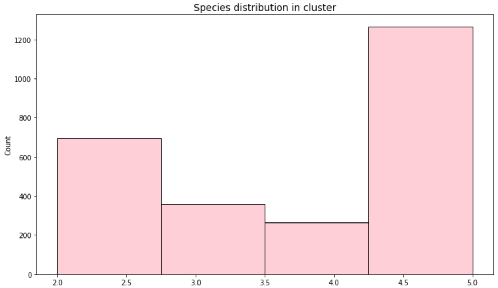

# Биоинформатика, 2 год
## Финальный проект 

# Z-DNA analysis for Actinomyces

# Информация по выбранным геномам

| Organism Name | GC% | Size (Mb) | Scaffolds |
| ------ |-----| -----| ---- |
| Actinomyces procaprae | 69,3 | 3,60035 | 1 |
| Actinomyces howellii | 71,7 | 3,14893 | 1 |
| Actinomyces marmotae | 71,6 | 2,4195 | 1 |
| Actinomyces naeslundii |  67,9 | 3,15212 | 1 |
| Actinomyces oris | 68,457 | 3,1904 | 2 |

Все выбранные организмы имеют достаточно высокий GC%

# Код
bio_project.ipynb

# Сводная таблица

| **Название Вида**   |  **Длина**| **Кол-во Аннотированных Генов** | **Доля Аннотированных Генов** | **Количество Предсказанных Участков Z-DNA** | **Кол-во Участков** (zh-score>500)| **Общая Длина** (zh-score>500)|
| ------ |-----| -----| -----| -----|  ----- | --------------------|
| *procaprae* (GCF_004798665.1_ASM479866v1)| 3600355 | 3010 | 85.4% | 3600355 | 57263 | 592384 |
| *howellii* (GCF_002076915.1_ASM207691v1)| 2359360 | 2015 | 88.5% | 2359360 | 43176 |  435586 |
| *marmotae* (GCF_013177295.1_ASM1317729v1)| 2419502 | 2011 | 87.5% | 2419502 | 47372 |  477512 |
| *naeslundii* (GCF_016127855.1_ASM1612785v1)| 3152123 | 2658 | 87.6% | 3152123 | 30106 | 304592 |
| *oris* (GCF_016127955.1_ASM1612795v1)|3190396 | 2661 | 87.1% | 3184721 | 33142 | 335754 |

## Распределение значений  ZH-score

- **Actinomyces procaprae** GCF_004798665.1_ASM479866v1
 
- **Actinomyces howellii** GCF_002076915.1_ASM207691v1

- **Actinomyces marmotae** GCF_013177295.1_ASM1317729v1
 
- **Actinomyces naeslundii** GCF_016127855.1_ASM1612785v1

- **Actinomyces oris** (GCF_016127955.1_ASM1612795v1)

## Расположение предсказанных Z-DNA:

## Гомологичные связи между белками выбранных геномов, выбор кластеров

## Таблица по кластерам

| Species | Genes |   Alg.-Conn. | GCF_002076915.1_ASM207691v1   | GCF_004798665.1_ASM479866v1   | GCF_013177295.1_ASM1317729v1   | GCF_016127855.1_ASM1612785v1   | GCF_016127955.1_ASM1612795v1   |   mean ZH-Score |
|------------:|--------:|-------------:|:------------------------------|:------------------------------|:-------------------------------|:-------------------------------|:-------------------------------|----------------:|
|           5 |       5 |            1 | WP_081172084.1                | WP_136314491.1                | WP_159624273.1                 | WP_003783649.1                 | WP_101559258.1                 |        121492   |
|           5 |       5 |            1 | WP_080461836.1                | WP_136313303.1                | WP_159524585.1                 | WP_003782055.1                 | WP_141407362.1                 |         95034.9 |
|           5 |       5 |            1 | WP_081170551.1                | WP_136193558.1                | WP_159524420.1                 | WP_003784190.1                 | WP_141406447.1                 |         80708.1 |
|           5 |       5 |            1 | WP_080462265.1                | WP_136314468.1                | WP_159522402.1                 | WP_076142734.1                 | WP_141405902.1                 |         63832.6 |
|           5 |       5 |            1 | WP_081171157.1                | WP_240038323.1                | WP_235905311.1                 | WP_003782845.1                 | WP_198498153.1                 |         56068.5 |
|           5 |       5 |            1 | WP_229657903.1                | WP_136192266.1                | WP_159524262.1                 | WP_003783958.1                 | WP_003786387.1                 |         51772.8 |
|           5 |       5 |            1 | WP_080462116.1                | WP_136192997.1                | WP_159522918.1                 | WP_003781441.1                 | WP_003781441.1                 |         46025.5 |
|           5 |       5 |            1 | WP_081170894.1                | WP_136192359.1                | WP_159523874.1                 | WP_043539339.1                 | WP_004565259.1                 |         37149.2 |
|           5 |       5 |            1 | WP_081171840.1                | WP_136313286.1                | WP_159523684.1                 | WP_003784503.1                 | WP_141406578.1                 |         35555.3 |
|           5 |       5 |            1 | WP_080463426.1                | WP_136313608.1                | WP_159523185.1                 | WP_003785801.1                 | WP_141406914.1                 |         35029.8 |

## Функции генов

## Выравнивания

Визуализация была получена в программе MEGA-X
##### 1 кластер

##### 2 кластер

##### 3 кластер

##### 4 кластер

##### 5 кластер

##### 6 кластер

##### 7 кластер

##### 8 кластер

##### 9 кластер

##### 10 кластер

Наиболее удачными оказались выравнивания для 3, 7, 8 и 9 кластеров

## Визуализация расположения Z-DNA относительно гомологичных генов из разных организмов

