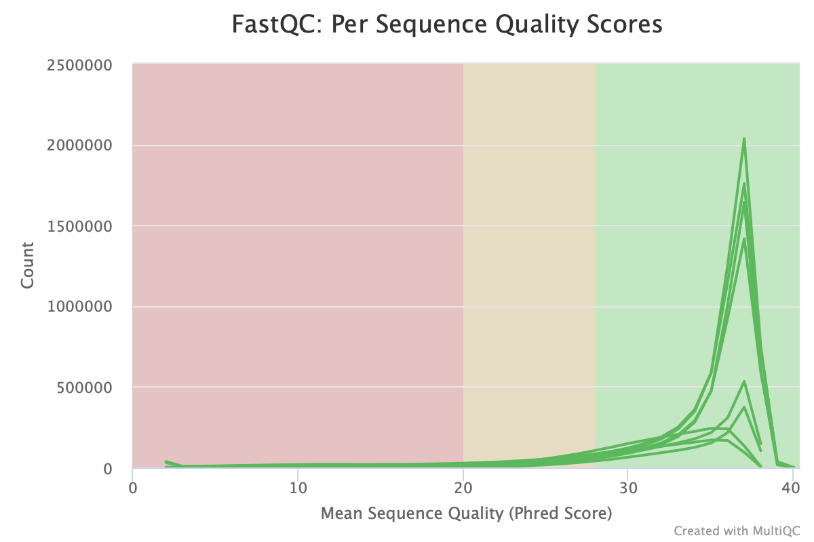

***
## Работа на сервере 
#### Создание папки для работы с данными 
(внутри папки homework1)
```
mkdir biodata 
```
#### Создание ссылок в папке
```
ls /usr/share/data-minor-bioinf/assembly/* | xargs -tI{} ln -s {}
```
#### Выбор 5 млн. paired-end ридов и 1,5 млн. mate-pairs ридов с random-seed 617
```
seqtk sample -s617 oil_R1.fastq 5000000 > R1_pe.fastq
seqtk sample -s617 oil_R2.fastq 5000000 > R2_pe.fastq
seqtk sample -s617 oilMP_S4_L001_R1_001.fastq 1500000 > R1_oilMP.fastq
seqtk sample -s617 oilMP_S4_L001_R2_001.fastq 1500000 > R2_oilMP.fastq
```
#### Оцениваем качество с fastQC
```
ls *.fastq | xargs -P 4 -tI{} fastqc -o fastqc {}
```
#### Получаем отчет multiQC
```
multiqc -o multiqc fastqc
```
#### Скачиваем файлы с сервера
(результаты fastqc и multiqc лежат в папках с соответствующими названиями)
```
scp -P 32222 -i /Users/mariadolgodvorova/desktop/biokey madolgodvorova@92.242.58.92:/home/madolgodvorova/homework1/biodata/multiqc/* /Users/mariadolgodvorova/desktop/hw1

scp -P 32222 -i /Users/mariadolgodvorova/desktop/biokey madolgodvorova@92.242.58.92:/home/madolgodvorova/homework1/biodata/fastqc/* /Users/mariadolgodvorova/desktop/hw1
```
###### Исходные чтения

###### Подрезанные чтения

###### Исходные чтения

###### Подрезанные чтения

###### Исходные чтения

###### Подрезанные чтения

###### Исходные чтения

###### Подрезанные чтения

###### Исходные чтения

###### Подрезанные чтения

###### Исходные чтения

###### Подрезанные чтения

###### Исходные чтения

###### Подрезанные чтения

#### Обрезаем чтения по качеству и удаляем праймеры при помощи platanus 
(после удаляем исходные ненужные)
```
platanus_trim R1_pe.fastq R2_pe.fastq
platanus_internal_trim R1_oilMP.fastq R2_oilMP.fastq
```
#### Переместим полученные файлы fastq в папку trimmed_f и оценим риды (данные сложим в result_trimmed_f)
```
mkdir trimmed_f
mv *trimmed trimmed_f/
mkdir result_trimmed_f
ls trimmed_f/* | xargs -P 4 -tI{} fastqc -o result_trimmed_f {}
```
#### Оценка качества обрезанных чтений 
(результаты сложим в папку trimmed_m)
```
mkdir trimmed_m
multiqc -o trimmed_m result_trimmed_f
```
#### Platanus assemble: сборка контигов подрезанных чтений
Использует 1 процессор с ограничением использования 12Гб
```
time platanus assemble -o Poil -t 1 -m 12 -f trimmed_f/R1_pe.fastq.trimmed  trimmed_f/R2_pe.fastq.trimmed 2>assemble.log
```
#### Platanus scaffold: сброка скаффолдов
```
time platanus scaffold -o Poil -c Poil_contig.fa -IP1 trimmed_f/R1_pe.fastq.trimmed  trimmed_f/R2_pe.fastq.trimmed -OP2 trimmed_f/R1_oilMP.fastq.int_trimmed trimmed_f/R2_oilMP.fastq.int_trimmed 2> scaffold.log
```
#### Файл с самым длинным скаффолдом
```
echo scaffold1_len3834567_cov231 > fin_scaff.txt
seqtk subseq Poil_scaffold.fa fin_scaff.txt > BiggestScaff.fna
rm fin_scaff.txt
```
#### Уменьшаем количество гэпов
```
time platanus gap_close -o Poil -c Poil_scaffold.fa -IP1 trimmed_f/R1_pe.fastq.trimmed  trimmed_f/R2_pe.fastq.trimmed -OP2 trimmed_f/R1_oilMP.fastq.int_trimmed trimmed_f/R2_oilMP.fastq.int_trimmed 2> gapclose.log
```
#### Выделим скаффолд в отдельный файл
```
echo scaffold1_cov231 > fin_scaff.txt
seqtk subseq Poil_gapClosed.fa fin_scaff.txt > longest.fna
rm fin_scaff.txt
```
