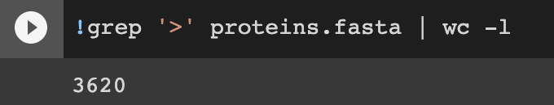
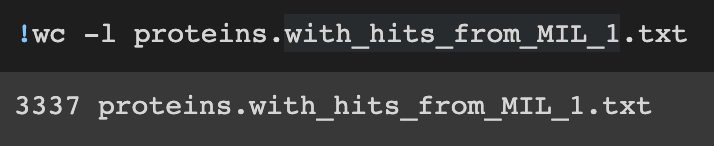
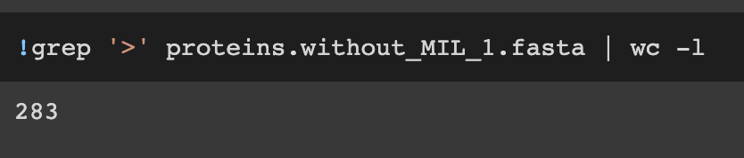
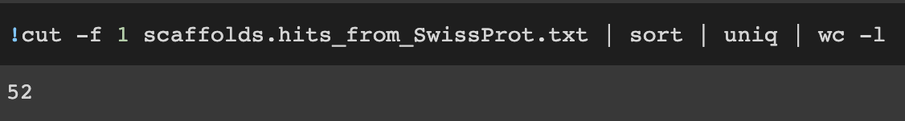
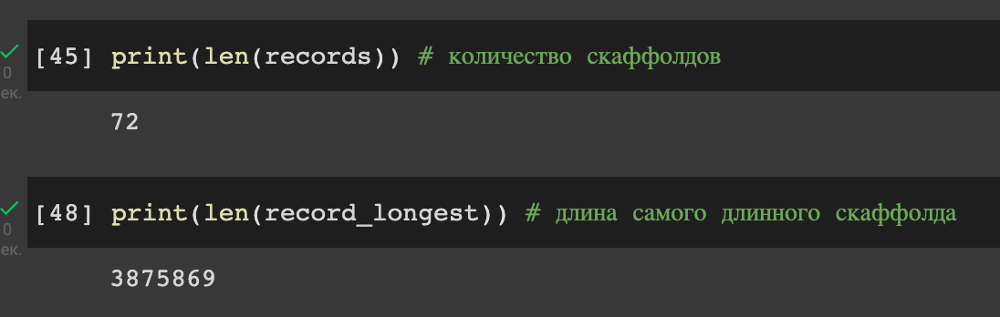

## *Google Colab*
- 1 часть - https://colab.research.google.com/drive/1Wbzw_ergoeBvZhhhid6slFqWYvJ_olmP?usp=sharing
- 2 часть - https://colab.research.google.com/drive/1m5trjJlFw3w9exsdF8fDtzfVzE_PPQAN?usp=sharing

## Статистика
##### Было предсказано генов всего
**3620**

##### Сколько из них удалось аннотировать с помощью сравнения с бактерией MIL-1
**3337**

##### Какое количество белков остались без аннотации функции
**283**

##### Количество белков, которые удалось аннотировать с помощью сравнения с бактерией MIL-1
**52**

##### Также для удобства количество скаффолдов и длина наибольшего 

