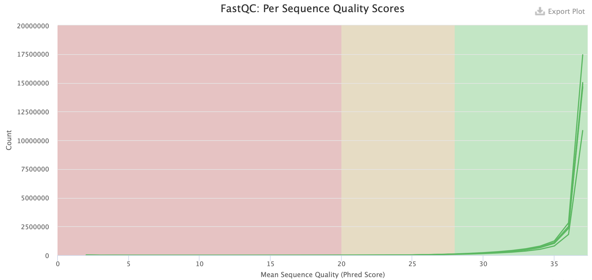
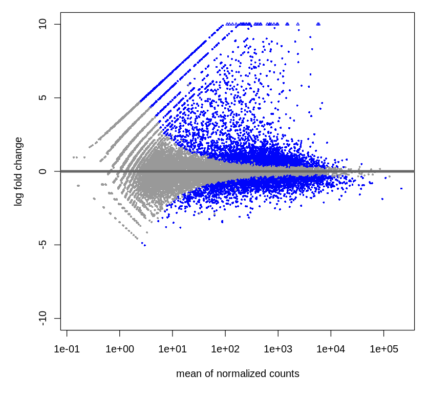
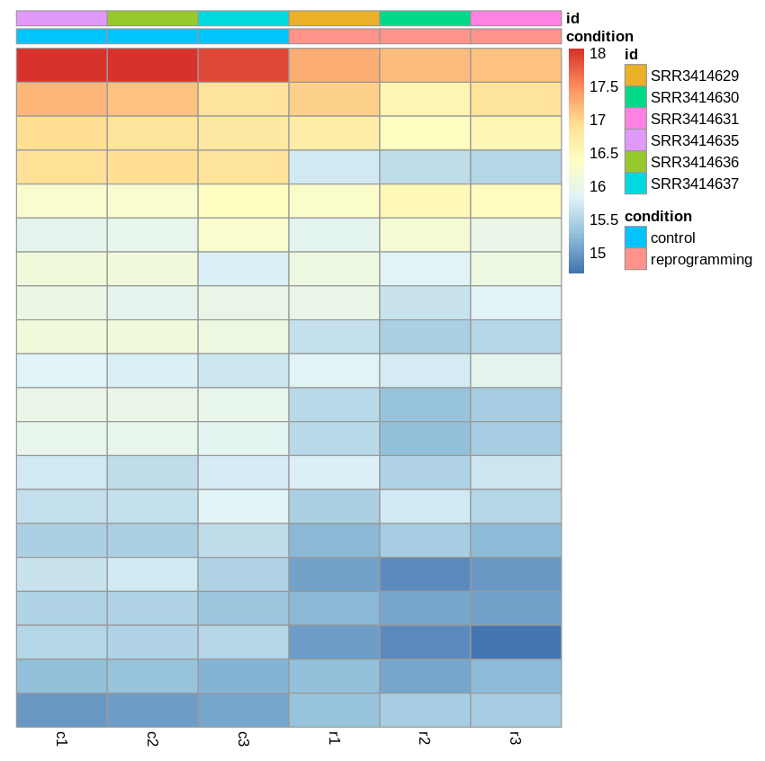

# *Google Colab*

- ссылка на гугл колаб (код с Python) - https://colab.research.google.com/drive/18RMbsWU1f-kZ-5SVoDgG78ynqFDvcs14?usp=sharing
- ссылка на гугл колаб (код с R) - https://colab.research.google.com/drive/1x5KYw93tXEoA_MmFO0t12Ah3XzZIhKAg?usp=sharing
### Статистика MultiQC

### Общее количество чтений

### Таблица для ALL.counts

### Графики R
- pheatmap

- plotMA

- Гены, отличающиеся сильнее всего с наименьшим p-*value*

