# hse_hw2_chip

## отчеты FastQC

**ENCFF001FWV**

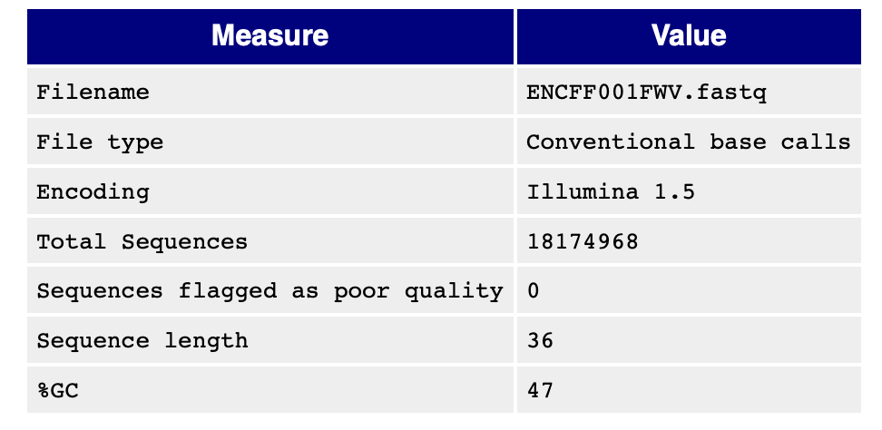
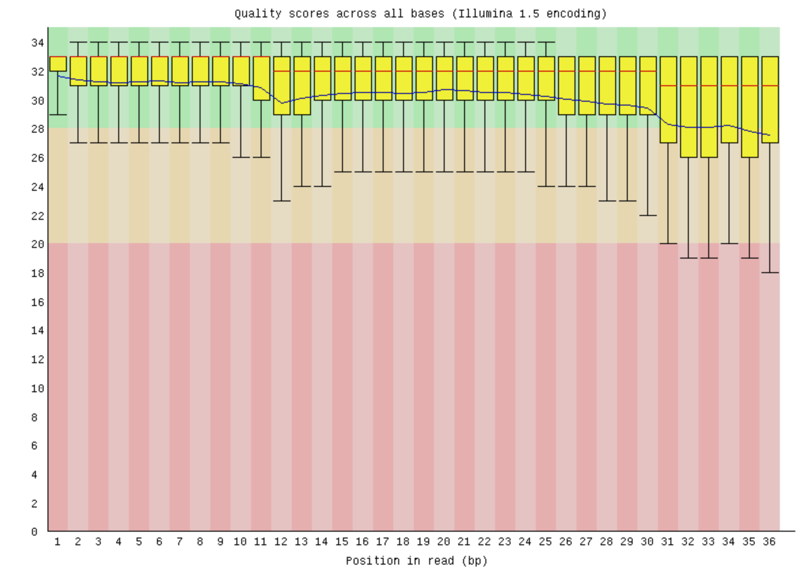
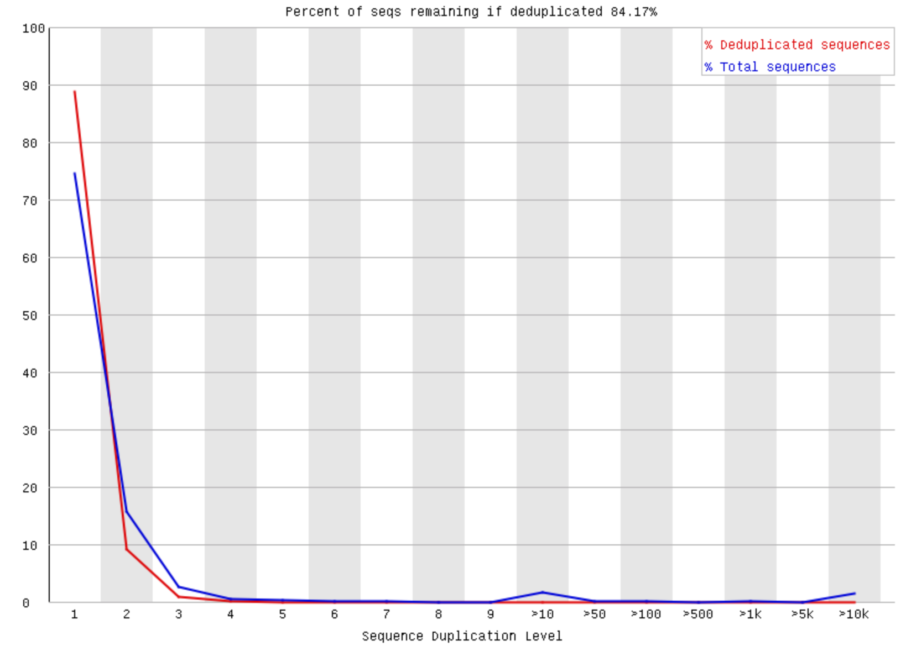

**ENCFF001FWW**

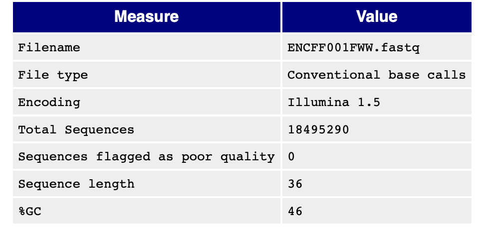
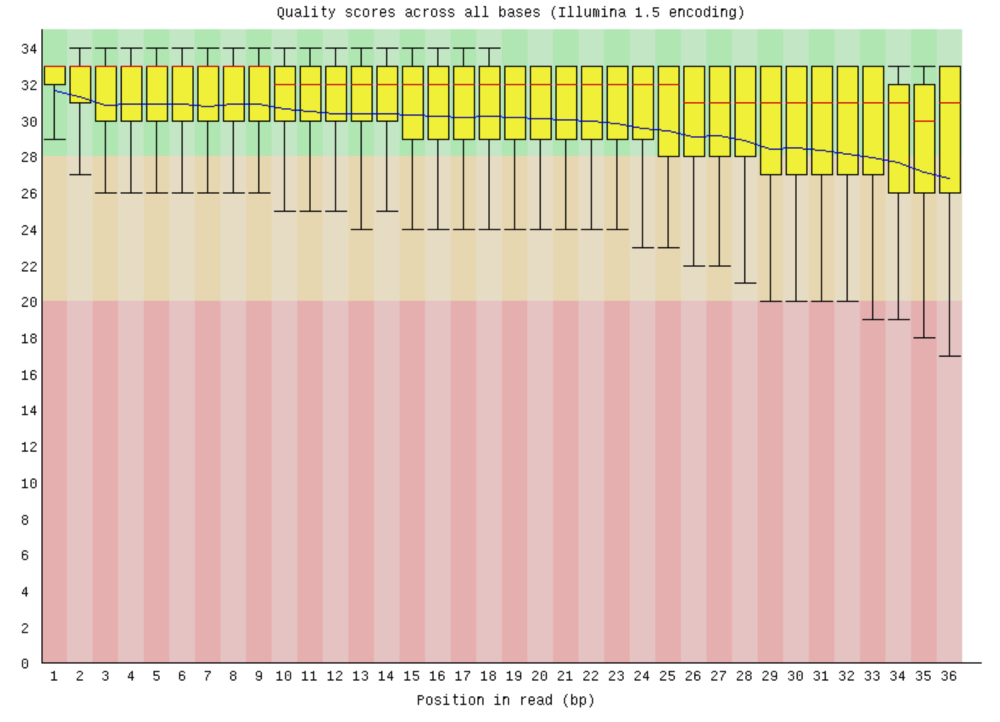
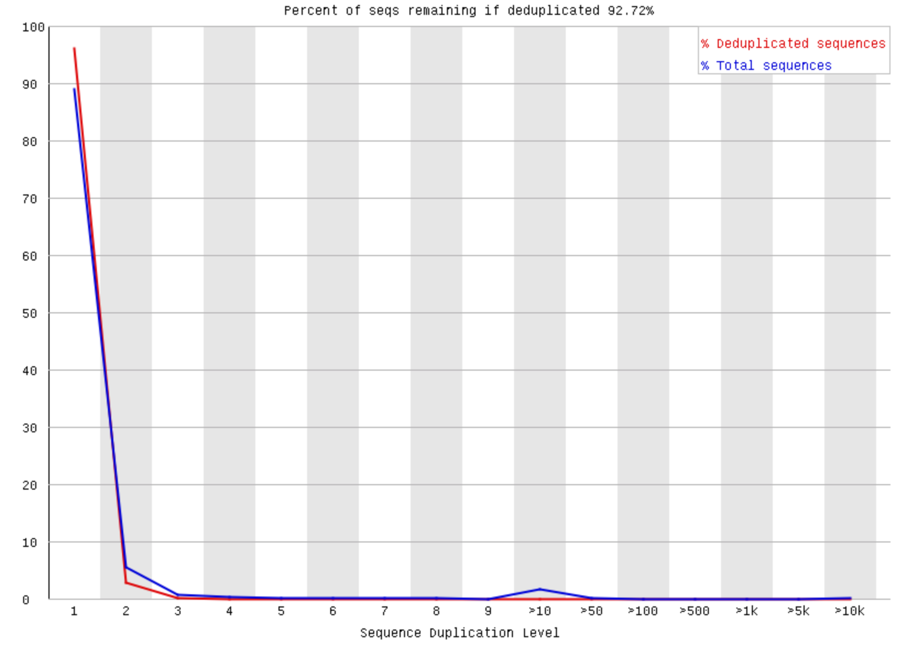

**Контроль**

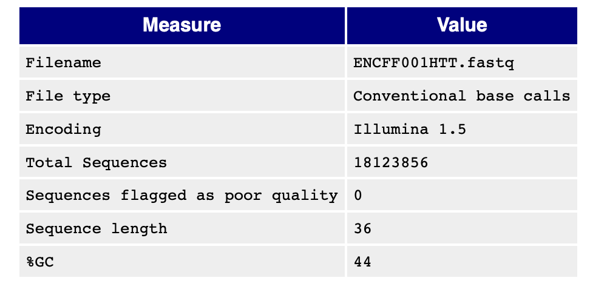
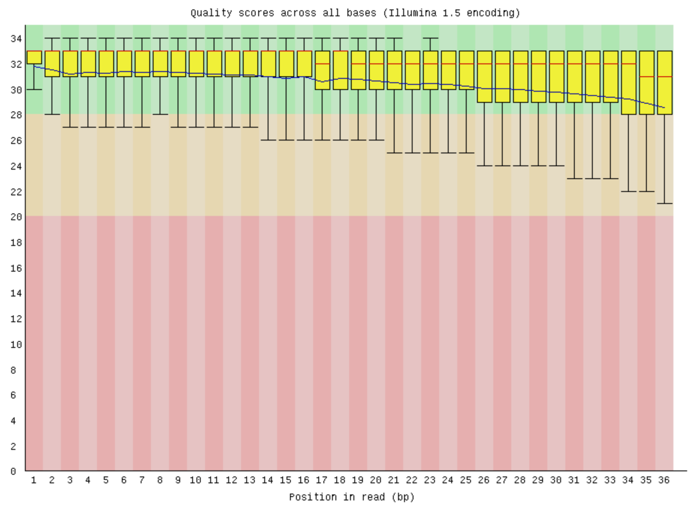
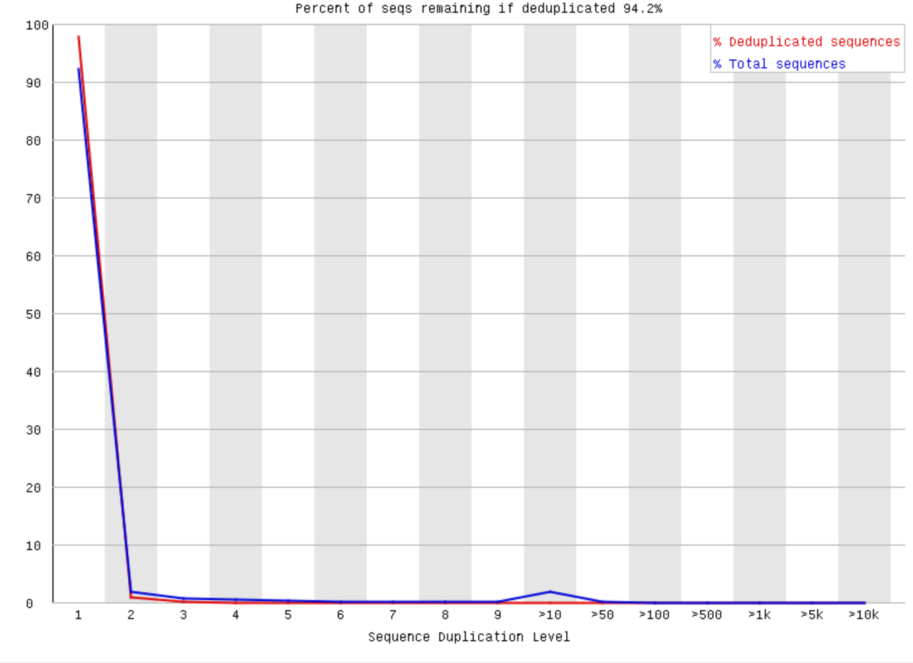

Per base sequence quality был не очень хорошим для ENCFF001FWW, поэтому чтения были подрезаны. В результате стало немного лучшше, но различия минимальны
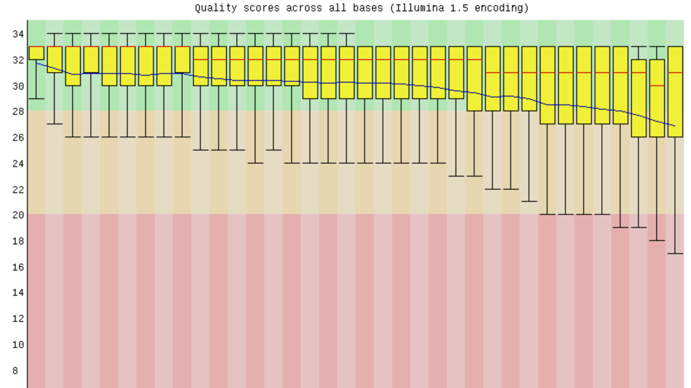

## Таблица со статистикой

| **Образец**   | **ENCFF001FWV**    | **ENCFF001FWW**| **ENCFF001HTT** |
| ------------- |:------------------:| -----| -----:|
| Всего ридов| 18174968 | 18495290 | 18123856 |
| Выравнилось уникально | 657811 | 681601 |  689129 |
| Выравнилось НЕ-уникально |  2969549 | 2837190 | 2570390 |
| ридов НЕ выравнилось | 14547608 | 14976499 | 14864337 |

Скорее всего, результат выравниваний получился такой, поскольку мы делаем выравнивания на 1 хромосому, а не на весь геном

## Диаграммы Венна
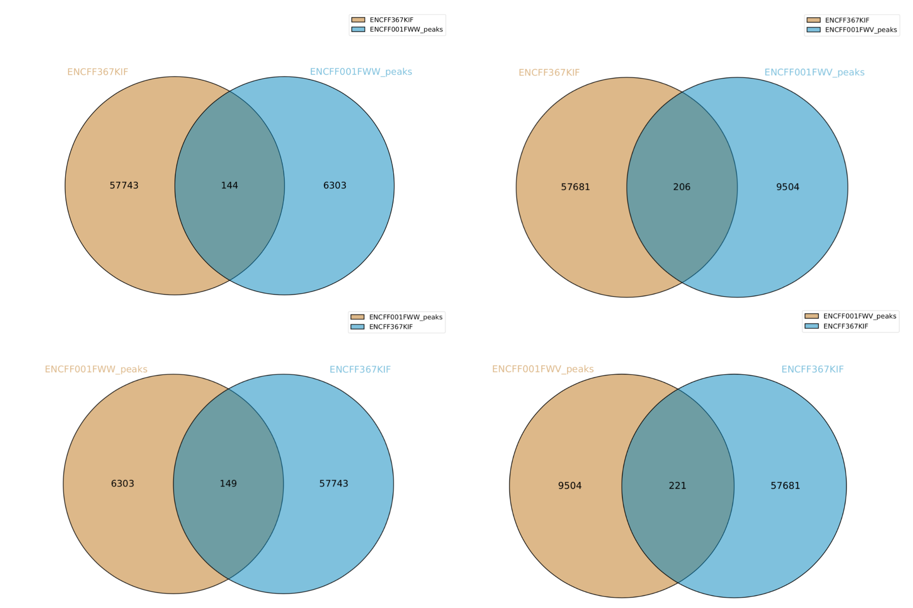

Вероятно, различия из-за количества пиков и порядка наложения участков
